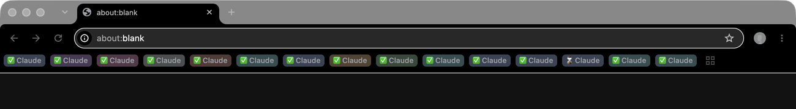
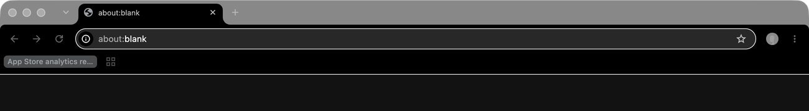

# chrome-tab-group-cleaner

**Chrome has no bulk delete for saved tab groups. This is one.**



*Before: 71 saved groups, 70 of them Claude's. The bar shows the 15 that fit; the
rest sit behind the grid button.*



*After: one run of `chrome-tab-group-cleaner delete --claude --orphans --restart`.
`App Store analytics review` survives - it is not a Claude group.*

Saved tab groups are those pill-shaped chips in the bookmarks bar, and the rows
behind the grid button next to them. Chrome's only way to remove one is
right-click -> *Delete group*, one at a time. There is nothing in Settings, no
multi-select, no "delete all".

That is fine until something makes them for you. The
[Claude in Chrome](https://chromewebstore.google.com/detail/claude/fcoeoabgfenejglbffodgkkbkcdhcgfn)
extension names its group `✅Claude` (`⌛Claude` while a task runs) and leaves one
behind per session. Three months in, my profile had 70 of them, plus 95 orphan
tabs left by Chrome's own housekeeping. That is 70 right-clicks - or one command.

Both screenshots are the same Chrome profile before and after that command. Not a
mockup: the store behind the "before" shot is a real backup, replayed and cleaned
by the tool in this repo.

## Where saved tab groups live

One LevelDB per profile, shared with other sync data types:

```
<user data>/<Profile>/Sync Data/LevelDB
```

One key per entity, `saved_tab_group-dt-<uuid>`. The value is a DataTypeStore
wrapper around a `SavedTabGroupSpecifics` protobuf:

```
{ 1: schema version, 2: SavedTabGroupSpecifics }

SavedTabGroupSpecifics { 1: guid, 2: created µs, 3: updated µs, 4: group, 5: tab }
  group { 2: title, 3: color, 4: position }
  tab   { 1: group guid, 2: position, 3: url, 4: title }
```

Timestamps are Windows-epoch (1601) microseconds. Colors are one-based into
`grey, blue, red, yellow, green, pink, purple, cyan, orange`.

A group is a group entity **plus** its tab entities: delete only the group and the
tabs linger as orphans, which is exactly how Chrome's own housekeeping leaves
them. `src/proto.ts` reads this wire format directly - no protobuf dependency.

## Install

```bash
git clone https://github.com/franzenzenhofer/chrome-tab-group-cleaner.git
cd chrome-tab-group-cleaner
npm install && npm run build
node dist/cli.js --help          # or: npm link, then chrome-tab-group-cleaner --help
```

Node 20+. One runtime dependency, `classic-level`, which ships prebuilt binaries.

## Use

```bash
chrome-tab-group-cleaner profiles                  # profiles, and which of them sync tab groups
chrome-tab-group-cleaner list --all-profiles -v    # every group, with its tabs

chrome-tab-group-cleaner delete --all              # every saved tab group
chrome-tab-group-cleaner delete --claude           # only what Claude in Chrome left behind
chrome-tab-group-cleaner delete --match workshop   # title contains "workshop"
chrome-tab-group-cleaner delete --regex '^Trail'   # title matches a pattern

chrome-tab-group-cleaner restore --backup ~/.chrome-tab-group-cleaner/backups/Default-...
```

| Option | |
|---|---|
| `--browser chrome\|chromium\|brave\|edge` | they all use the same store (default `chrome`) |
| `--profile <dir>` / `--all-profiles` | a profile directory such as `Default` or `Profile 2` |
| `--orphans` | also sweep tabs whose group is already gone - Chrome leaves plenty |
| `--dry-run` | print what would happen, touch nothing |
| `--restart` | quit the browser, delete, reopen the same tabs in the same profiles (macOS) |
| `--sync-tombstone` | on a profile that syncs tab groups, commit the deletion to the account |
| `--user-data-dir <path>` | a user data directory other than the browser's own |

**The browser must be quit for a delete.** Its LevelDB is locked exclusively, and
a running browser rewrites the store from memory when it exits - so a delete
underneath it would simply be undone. `list` works either way: it reads a
throwaway copy when the lock is held. `--restart` does the quit-and-reopen for you.

Every delete copies the whole store to `~/.chrome-tab-group-cleaner/backups/`
first (override with `CHROME_TAB_GROUP_CLEANER_BACKUPS`). `restore` puts only the
saved-tab-group keys back; nothing else in the store is touched.

## Sync

A profile that syncs tab groups re-downloads whatever you delete locally, so a
plain `delete` refuses to touch one and says so. The tool reads the profile's own
`Preferences` to decide (`sync.keep_everything_synced`, `sync.saved_tab_groups`),
and `profiles` marks such profiles. Three routes work there:

- `--sync-tombstone`, below: the deletion is committed to the account and reaches
  every other device.
- Turn *Tab groups* off in `chrome://settings/syncSetup/advanced` and **leave it
  off**, then delete locally. Turning it back on re-downloads the server copy, so
  that toggle is the decision, not a way around it.
- Delete them in the UI on one device. Chrome writes the same tombstones itself.

### --sync-tombstone

Every synced entity has a metadata record beside its data at
`<type>-md-<storage key>`, a `sync_pb::EntityMetadata`:

```
1 client_tag_hash   2 server_id       3 is_deleted            4 sequence_number
5 acked_sequence_number               6 server_version
7 creation_time ms  8 modification_time ms                    9 specifics_hash
```

A deletion Chrome will propagate is: drop the `-dt-` record, and keep `-md-` with
`is_deleted = 1`, `sequence_number = acked_sequence_number + 1`, `specifics_hash`
cleared and `modification_time` set to now. A sequence number ahead of the acked
one is what the processor reads on startup as an uncommitted local change; it
commits the deletion, and the account tells every other device to drop the group.

Without the flag the metadata is deleted along with the data, so nothing dangles.

Two guards sit in front of that write. The record must carry a client tag hash -
without one Chrome is not tracking the entity, and there is nothing to commit
against. And the record must re-encode byte for byte through this tool's reader,
which is refused otherwise: a repeated field or an unusual field order would
survive decoding but not re-encoding, and metadata Chrome considers inconsistent
makes it clear the data type and download it again.

**What is verified, and what is not.** The bytes written are covered by tests,
and the field numbers were read out of a live Chrome store rather than assumed.
Whether a given Chrome build's sync processor accepts a tombstone it did not
write itself is not verified against a live Google account. If it does not, the
worst case is the one you already had: the groups come back. The store is backed
up before the write either way, and `restore` puts it back.

## Development

```bash
npm run gates      # typecheck, lint, test, build - all must pass
```

Tests build real LevelDB stores from the encoder and read them back. No mocks.

## Licence

MIT
